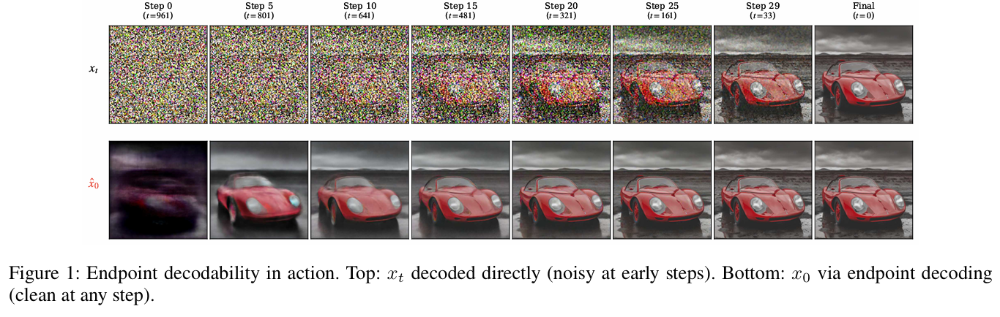
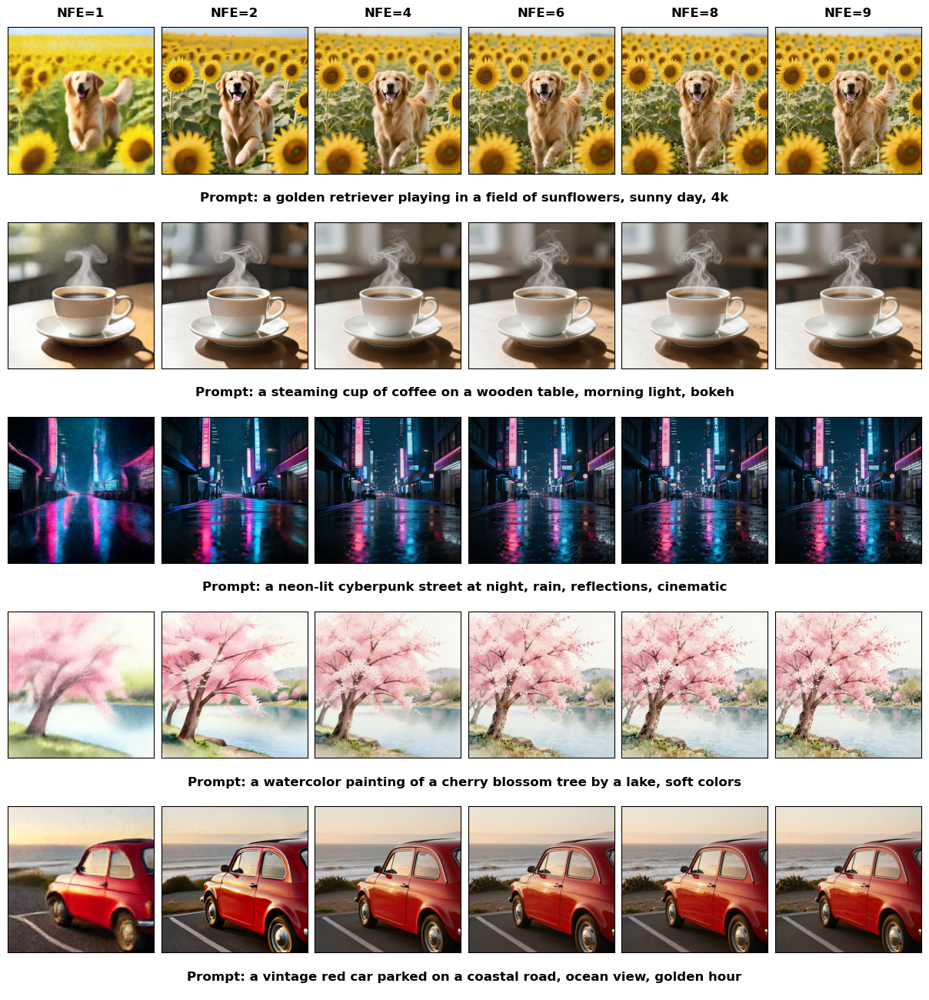
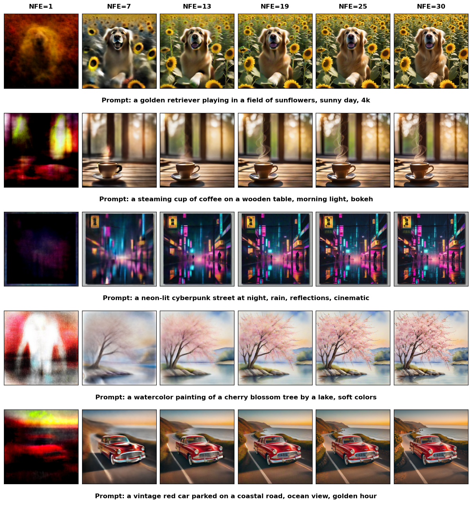
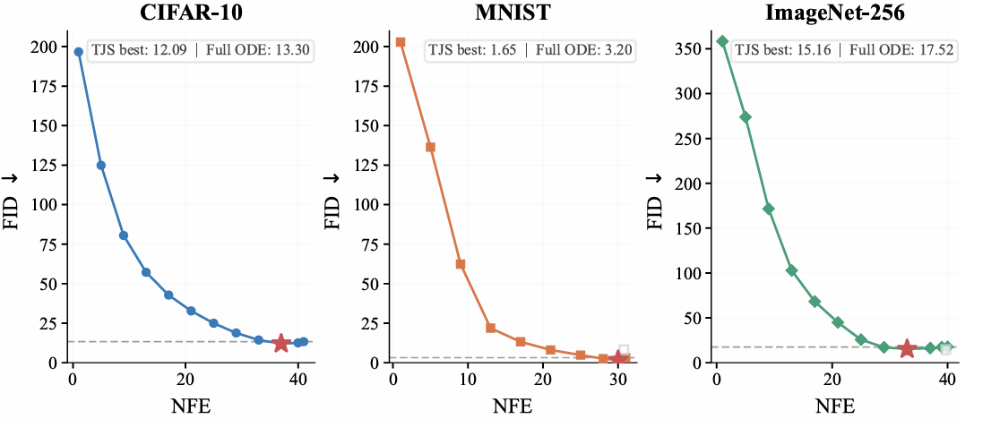

# ComfyUI_TJS - Truncated Jump Sampling

[中文](README.md) | English

ComfyUI_TJS is a custom node plugin for ComfyUI, built to experiment with
**TJS (Truncated Jump Sampling)**.

This plugin explores a training-free sampling acceleration idea based on
endpoint / denoised prediction.

## Paper

```bibtex
@article{peng2026x,
  title={x-Prediction Is All You Need: Training-Free Accelerated Generation via Endpoint Decodability},
  author={Peng, Xin and Gao, Ang},
  journal={arXiv preprint arXiv:2607.06114},
  year={2026}
}
```

## What It Does

TJS is based on a simple idea: diffusion and flow-matching samplers may not
need to traverse the full trajectory. At an intermediate step, the model
already produces an `x0` / `denoised` endpoint estimate. TJS runs only part of
the sampling trajectory, then uses that endpoint prediction as the final latent.

Simplified algorithm:

```text
k* = ceil(gamma * K)
run sampler from sigma[0] to sigma[k*]
return x0_hat(xt, sigma[k*]) with one endpoint model call
```

Where:

- `K` is the full sampling step budget.
- `gamma` is the early-exit ratio, for example `0.6`.
- `k*` is the actual early-exit step.
- `x0_hat` is the clean endpoint estimate predicted from the intermediate latent.

In ComfyUI, this endpoint estimate corresponds to the model wrapper's native
`denoised` latent. In principle, this makes the approach usable with diffusion,
flow-matching, Flux/SD3-style model wrappers, and related models.

When `gamma = 1.0`, the node runs the full sampling schedule and skips the
extra endpoint call, matching the ordinary KSampler boundary case.

## Tested Models

| Model | Status |
|---|---|
| **SDXL** | ✅ Tested |
| **SD3.5M** | ✅ Tested |
| **Z-Image-Turbo** | ✅ Tested |
| **Anima** | ✅ Tested |
| **Krea2** | ✅ Tested |
| **Krea2-Turbo** | ✅ Tested |

### Upcoming Tests

- Qwen-Image-Edit-2511
- Diffusion-based video generation models

## Changelog

### 2026-07-13 Fixed TJS Speed Below Theoretical Value

**Issue**: When `gamma = 1.0` (early exit time set to 1), the TJS sampler was
slower than the original KSampler, causing TJS acceleration to fall short of
the theoretical ratio.

**Root cause**: The old implementation used two separate sampling calls to
complete TJS — first a truncated sampling run to `sigma[k*]`, then a separate
endpoint decode call `sample_custom(sigmas=[sigma*, 0])`. Each call went through
the full ComfyUI sampling pipeline (creating CFGGuider, loading model, preparing
conditions, cleanup), meaning the theoretical NFE = k* + 1's "+1" was far more
than a single forward pass.

**Fix**: Changed to a single sampling call. By appending 0 to the truncated
sigmas: `[sigma_0, ..., sigma_{k*}, 0]`, the sampler performs one extra step
(sigma* -> 0) in the same call. The k-diffusion callback captures both
`denoised` (x0 prediction) and `x` (state at sigma*) at the last step,
eliminating all overhead from the second sampling call.

After the fix, `gamma = 1.0` matches the original KSampler speed exactly, and
acceleration ratios at other gamma values are closer to theoretical.

## Visual Examples

Endpoint decodability: the top row decodes intermediate noisy latents directly,
while the bottom row uses endpoint / denoised prediction to estimate the clean
endpoint.



Z-Image-Turbo generation quality at different NFE budgets:



SDXL 30-step NFE progression:



FID versus NFE trend:



## Installation

Copy this folder into ComfyUI's custom node directory:

```text
ComfyUI/custom_nodes/ComfyUI_TJS/
```

Then restart ComfyUI.

## Nodes

### TJS Sampler (Truncated Jump Sampling)

This is the main one-shot node, usable as a drop-in replacement for the normal
text-to-image sampler.

Inputs:

| Input | Description |
|---|---|
| `model` | Loaded ComfyUI model |
| `total_steps` | Full sampling step budget `K`, for example `30` |
| `early_exit_gamma` | Early-exit ratio, for example `0.6` |
| `cfg` | CFG scale |
| `sampler_name` | ComfyUI sampler used for the truncated trajectory |
| `scheduler` | ComfyUI sigma scheduler |
| `positive` / `negative` | Positive / negative conditioning |
| `latent_image` | Empty latent or input latent |
| `seed` | Random seed |
| `model_type` | Informational selector: `auto`, `diffusion`, or `flow` |
| `denoise` | Optional denoise strength |

Outputs:

| Output | Description |
|---|---|
| `latent_x0` | Endpoint decoded latent; connect this to VAE Decode |
| `latent_xt` | Intermediate noisy latent at the early-exit step |
| `k_star` | Actual early-exit step |
| `nfe_used` | `k_star + 1` for early exit, or `K` when `gamma = 1.0` |
| `nfe_saving_pct` | NFE saving percentage relative to full sampling |
| `sigma_at_exit` | Sigma used by the endpoint decode |

### TJS Advanced Sampler (KSampler Advanced + Endpoint)

This is a TJS-enhanced version of KSampler Advanced. It has TJS endpoint decode
built in, so there is no need to chain two nodes.

Compared to `TJSSampler`, it additionally supports:

- `add_noise` = `enable` / `disable`: controls whether initial noise is added (for img2img).
- `start_at_step`: start sampling from a specified step (for multi-stage workflows).
- `noise_seed`: seed parameter consistent with KSampler Advanced.

Inputs:

| Input | Description |
|---|---|
| `model` | Loaded ComfyUI model |
| `add_noise` | `enable` to add noise (txt2img), `disable` for img2img |
| `noise_seed` | Random seed |
| `steps` | Full sampling step budget `K` |
| `early_exit_gamma` | Early-exit ratio `gamma` |
| `cfg` | CFG scale |
| `sampler_name` | ComfyUI sampler |
| `scheduler` | ComfyUI scheduler |
| `positive` / `negative` | Positive / negative conditioning |
| `latent_image` | Empty latent or input latent |
| `start_at_step` | Start step (default `0`) |
| `model_type` | Informational selector |

Outputs: same as `TJSSampler`: `latent_x0`, `latent_xt`, `k_star`, `nfe_used`, `nfe_saving_pct`, `sigma_at_exit`.

### TJS Custom (SamplerCustom + Endpoint)

This is the TJS version of ComfyUI's custom sampler, mirroring the native
`SamplerCustom` interface with an additional `early_exit_gamma` parameter.

Difference from `TJSCustomAdvanced`: `TJSCustom` directly takes `model`, `cfg`,
`positive`, `negative` (internally creates a CFGGuider), while `TJSCustomAdvanced`
requires manually connecting guider and noise objects. `TJSCustom` is simpler to
use, `TJSCustomAdvanced` is more flexible.

Inputs are the same as `SamplerCustom` (model, add_noise, noise_seed, cfg,
positive, negative, sampler, sigmas, latent_image) plus `early_exit_gamma`.

Outputs: `latent_x0`, `latent_xt`, `k_star`, `nfe_used`, `nfe_saving_pct`, `sigma_at_exit`.

### TJS Custom Advanced (SamplerCustomAdvanced + Endpoint)

This is the TJS version of ComfyUI's custom advanced sampler, mirroring the
native `SamplerCustomAdvanced` interface with an additional `early_exit_gamma`
parameter. Supports all ComfyUI guider types (CFGGuider, BasicGuider, DualCFGGuider).

Inputs are the same as `SamplerCustomAdvanced` (noise, guider, sampler, sigmas,
latent_image) plus `early_exit_gamma`.

Outputs: `latent_x0`, `latent_xt`, `k_star`, `nfe_used`, `nfe_saving_pct`, `sigma_at_exit`.

## Usage Examples

### Direct TJS Sampler Usage

Example settings:

```text
total_steps = 30
early_exit_gamma = 0.6
```

The node runs to:

```text
k* = ceil(0.6 * 30) = 18
```

Then it performs one endpoint call:

```text
NFE = 18 + 1 = 19
```

Compared with full 30-step sampling, this saves about `36.7%` NFE.

### Using TJS Advanced Sampler

`TJSAdvancedSampler` is an all-in-one node — no need to chain KSampler Advanced:

```text
steps = 30
early_exit_gamma = 0.6
add_noise = enable
start_at_step = 0
```

The node automatically computes `k* = 18`, runs truncated sampling, then
performs endpoint decode.

For img2img workflows:

```text
add_noise = disable
start_at_step = 0
```

No noise is added; sampling starts directly from the input latent.
